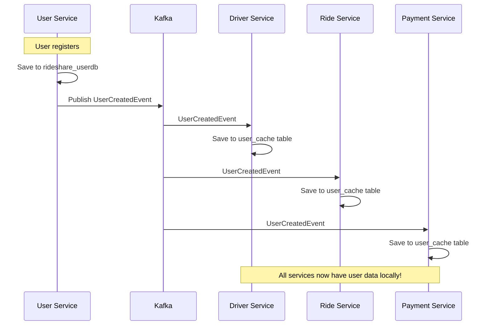

# Event-Driven Microservices Architecture Implementation Guide
## Distributed Ride-Sharing System with Apache Kafka

### 📋 Table of Contents
1. [Overview](#overview)
2. [Prerequisites](#prerequisites)
3. [Tech Stack](#tech-stack)
4. [Database Architecture](#database-architecture)
5. [Architecture Design](#architecture-design)
6. [Implementation Phases](#implementation-phases)
7. [Step-by-Step Implementation](#step-by-step-implementation)
8. [Event Schemas](#event-schemas)
9. [Service Dependencies](#service-dependencies)
10. [Testing Strategy](#testing-strategy)
11. [Production Considerations](#production-considerations)

---

## 📖 Overview

This guide walks you through implementing event-driven architecture for a distributed ride-sharing system. Instead of services making direct HTTP calls to each other, they communicate through Apache Kafka events, providing better scalability, fault tolerance, and loose coupling.

### 🎯 What You'll Build

```
┌─────────────────┐    Events     ┌─────────────────┐    Events     ┌─────────────────┐
│   User Service  ├──────────────►│  Apache Kafka   ├──────────────►│ Driver Service  │
│                 │               │                 │               │                 │
│ • Registration  │               │ Topics:         │               │ • Profile Mgmt  │
│ • Authentication│               │ • user.events   │               │ • Availability  │
│ • Profile Mgmt  │               │ • driver.events │               │ • Matching      │
└─────────────────┘               │ • ride.events   │               └─────────────────┘
                                  │ • payment.events│
┌─────────────────┐               │ • notification. │               ┌─────────────────┐
│  Ride Service   │◄──────────────┤   events        ├──────────────►│Payment Service  │
│                 │               └─────────────────┘               │                 │
│ • Ride Requests │                                                │ • Billing       │
│ • Trip Tracking │                                                │ • Payments      │
│ • Ride History  │               ┌─────────────────┐               │ • Refunds       │
└─────────────────┘               │ Notification    │               └─────────────────┘
                                  │    Service      │
                                  │                 │
                                  │ • Push Notifs   │
                                  │ • SMS/Email     │
                                  │ • Real-time     │
                                  └─────────────────┘
```

---

## 🔧 Prerequisites

### Knowledge Requirements
- **Java 21** & Spring Boot 3.5+
- **Apache Kafka** basics (topics, producers, consumers)
- **PostgreSQL** database management
- **Docker** & Docker Compose
- **Microservices** architecture patterns
- **Event Sourcing** & **CQRS** concepts

### Development Environment
- **JDK 21** installed
- **Docker Desktop** running
- **IDE** (IntelliJ IDEA/VSCode)
- **Git** for version control
- **Postman/curl** for API testing

---

## 🛠️ Tech Stack

### Core Infrastructure
- **Apache Kafka 3.6** - Event streaming platform
- **Confluent Platform** - Schema registry, control center
- **PostgreSQL 15** - Database per service
- **Docker & Docker Compose** - Containerization

### Backend Services
- **Spring Boot 3.5.6** - Microservices framework
- **Spring Kafka** - Kafka integration
- **Spring Data JPA** - Data access layer
- **Spring Security** - Authentication & authorization
- **Lombok** - Code generation

### Serialization & Schema Management
- **Apache Avro** - Schema evolution
- **Confluent Schema Registry** - Schema management
- **JSON** - Simple event serialization (alternative)

### Monitoring & Observability
- **Confluent Control Center** - Kafka monitoring
- **Spring Boot Actuator** - Service health
- **Slf4j + Logback** - Logging

---

## 🗄️ Database Architecture

### 🎯 Single PostgreSQL Container, Multiple Databases

Your ride-sharing system uses a **single PostgreSQL container** hosting **multiple databases** to maintain service isolation while simplifying infrastructure management.

#### Database Structure
```
PostgreSQL Container (localhost:5432)
├── rideshare_userdb      → User Service
├── rideshare_driverdb    → Driver Service  
├── rideshare_ridedb      → Ride Service
├── rideshare_paymentdb   → Payment Service
└── rideshare_notificationdb → Notification Service
```

### 📊 Database per Service Pattern with Shared Infrastructure

```
┌─────────────────┐     ┌─────────────────┐     ┌─────────────────┐
│   User Service  │     │  Driver Service │     │  Ride Service   │
│                 │     │                 │     │                 │
│ Port: 8080      │     │ Port: 8081      │     │ Port: 8082      │
└─────────┬───────┘     └─────────┬───────┘     └─────────┬───────┘
          │                       │                       │
          │                       │                       │
    ┌─────▼──────┐          ┌─────▼──────┐          ┌─────▼──────┐
    │rideshare_  │          │rideshare_  │          │rideshare_  │
    │  userdb    │          │ driverdb   │          │  ridedb    │
    │            │          │            │          │            │
    │• users     │          │• drivers   │          │• rides     │
    │• roles     │          │• vehicles  │          │• bookings  │
    │• auth      │          │• user_cache│          │• tracking  │
    └────────────┘          └────────────┘          └────────────┘
                    ┌─────────────────────────────────┐
                    │     PostgreSQL Container        │
                    │                                 │
                    │ Host: localhost:5432            │
                    │ User: rideshare                 │
                    │ Password: rideshare123          │
                    └─────────────────────────────────┘
```

### 🔧 Database Configuration per Service

#### User Service (rideshare_userdb)
```yaml
# application.yml
spring:
  datasource:
    url: jdbc:postgresql://localhost:5432/rideshare_userdb
    username: rideshare
    password: rideshare123
    driver-class-name: org.postgresql.Driver
  jpa:
    hibernate:
      ddl-auto: update
    database-platform: org.hibernate.dialect.PostgreSQLDialect
    show-sql: false
```

**Tables:**
- `users` - User profiles, authentication, roles
- `user_sessions` - JWT token management (if needed)

#### Driver Service (rideshare_driverdb)
```yaml
# application.yml  
spring:
  datasource:
    url: jdbc:postgresql://localhost:5432/rideshare_driverdb
    username: rideshare
    password: rideshare123
    driver-class-name: org.postgresql.Driver
  jpa:
    hibernate:
      ddl-auto: update
    database-platform: org.hibernate.dialect.PostgreSQLDialect
```

**Tables:**
- `drivers` - Driver profiles, licenses, vehicles
- `user_cache` - **Local copy of user data from User Service** (populated via Kafka events)
- `driver_locations` - Real-time location tracking
- `driver_ratings` - Driver performance metrics

#### Ride Service (rideshare_ridedb)
```yaml
# application.yml
spring:
  datasource:
    url: jdbc:postgresql://localhost:5432/rideshare_ridedb
    username: rideshare
    password: rideshare123
```

**Tables:**
- `rides` - Ride requests, bookings, trip data
- `user_cache` - **Local copy of user data** (from User Service events)
- `driver_cache` - **Local copy of driver data** (from Driver Service events)
- `ride_tracking` - GPS coordinates, timestamps
- `ride_history` - Completed rides for analytics

#### Payment Service (rideshare_paymentdb)
```yaml
# application.yml
spring:
  datasource:
    url: jdbc:postgresql://localhost:5432/rideshare_paymentdb
    username: rideshare
    password: rideshare123
```

**Tables:**
- `payments` - Transaction records, billing
- `ride_cache` - **Local copy of ride data** (from Ride Service events)
- `user_cache` - **Local copy for billing** (from User Service events)
- `invoices` - Generated receipts
- `payment_methods` - Credit cards, wallets

### 🔄 Event-Driven Data Synchronization

#### How Local Caches Stay in Sync



### 🛡️ Data Consistency Strategy

#### 1. **Strong Consistency** (within service)
- Each service maintains strong consistency in its own database
- ACID transactions within service boundaries

#### 2. **Eventual Consistency** (across services)  
- Data synchronizes via Kafka events
- Local caches updated asynchronously
- Compensating actions for failures

#### 3. **Data Ownership Rules**
```
✅ User Service owns: user profiles, authentication
✅ Driver Service owns: driver data, vehicle info, availability
✅ Ride Service owns: ride lifecycle, booking, tracking  
✅ Payment Service owns: transactions, billing, invoices

❌ Services never directly query other service databases
❌ Cross-service joins are not allowed
❌ Shared database access is forbidden
```

### 📋 Database Setup Instructions

#### 1. Initialize Databases
```sql
-- infra/init-db/01-create-dbs.sql
CREATE DATABASE rideshare_userdb;
CREATE DATABASE rideshare_driverdb; 
CREATE DATABASE rideshare_ridedb;
CREATE DATABASE rideshare_paymentdb;
CREATE DATABASE rideshare_notificationdb;

-- Create service-specific users (optional for better security)
CREATE USER user_service_user WITH PASSWORD 'user_pass123';
CREATE USER driver_service_user WITH PASSWORD 'driver_pass123';
CREATE USER ride_service_user WITH PASSWORD 'ride_pass123';
CREATE USER payment_service_user WITH PASSWORD 'payment_pass123';

-- Grant database access
GRANT ALL PRIVILEGES ON DATABASE rideshare_userdb TO user_service_user;
GRANT ALL PRIVILEGES ON DATABASE rideshare_driverdb TO driver_service_user;
GRANT ALL PRIVILEGES ON DATABASE rideshare_ridedb TO ride_service_user;
GRANT ALL PRIVILEGES ON DATABASE rideshare_paymentdb TO payment_service_user;
```

#### 2. Docker Compose Database Setup
```yaml
# docker-compose.kafka.yml (updated)
postgres:
  image: postgres:15-alpine
  container_name: rideshare-postgres
  environment:
    POSTGRES_DB: postgres
    POSTGRES_USER: rideshare
    POSTGRES_PASSWORD: rideshare123
  ports:
    - "5432:5432"
  volumes:
    - postgres-data:/var/lib/postgresql/data
    - ./infra/init-db:/docker-entrypoint-initdb.d  # Auto-run SQL scripts
  networks:
    - rideshare-network
```

#### 3. Service Configuration Examples

**User Service application.yml:**
```yaml
spring:
  datasource:
    url: jdbc:postgresql://localhost:5432/rideshare_userdb
    username: rideshare
    password: rideshare123
  jpa:
    hibernate:
      ddl-auto: update
    show-sql: false
  kafka:
    bootstrap-servers: localhost:9092
    producer:
      key-serializer: org.apache.kafka.common.serialization.StringSerializer
      value-serializer: org.springframework.kafka.support.serializer.JsonSerializer
```

**Driver Service application.yml:**
```yaml
spring:
  datasource:
    url: jdbc:postgresql://localhost:5432/rideshare_driverdb
    username: rideshare  
    password: rideshare123
  jpa:
    hibernate:
      ddl-auto: update
  kafka:
    bootstrap-servers: localhost:9092
    consumer:
      group-id: driver-service-group
      key-deserializer: org.apache.kafka.common.serialization.StringDeserializer
      value-deserializer: org.springframework.kafka.support.serializer.JsonDeserializer
```

### 🚀 Benefits of This Database Architecture

#### ✅ **Advantages**
1. **Service Isolation** - Each service owns its data
2. **Simplified Infrastructure** - Single PostgreSQL container
3. **Local Performance** - No cross-service database calls
4. **Event-Driven Sync** - Data stays consistent via Kafka
5. **Easy Development** - All databases accessible locally

#### ⚠️ **Considerations**  
1. **Eventually Consistent** - Some delay in data propagation
2. **Duplicate Data** - User info cached in multiple services  
3. **Event Ordering** - Must handle out-of-order events
4. **Schema Evolution** - Changes require careful event versioning

### 📊 Local Cache Management

#### Example: User Cache in Driver Service
```java
// Driver Service - User Cache Entity
@Entity
@Table(name = "user_cache")
public class UserCache {
    @Id
    private UUID userId;
    private String name;
    private String email;
    private String phone;
    private String role;
    private Boolean isActive;
    private LocalDateTime lastUpdated;
    
    // Populated via UserCreatedEvent, UserUpdatedEvent
    // Deactivated via UserDeletedEvent
}
```

#### Cache Update Flow
```java
// When UserUpdatedEvent arrives
@KafkaListener(topics = "user.events")
public void handleUserUpdated(UserUpdatedEvent event) {
    UserCache cache = userCacheRepository.findById(event.getUserId());
    if (cache != null) {
        cache.setName(event.getName());
        cache.setEmail(event.getEmail());
        cache.setLastUpdated(LocalDateTime.now());
        userCacheRepository.save(cache);
    }
}
```

This database architecture follows microservices best practices while maintaining practical simplicity for development and deployment! 🚀

---

## 🏗️ Architecture Design

### 🎯 Core Principles

1. **Database per Service** - Each microservice owns its data
2. **Event-First Design** - Services communicate via events
3. **Eventual Consistency** - Data synchronizes asynchronously
4. **Loose Coupling** - Services don't depend on each other directly
5. **Saga Pattern** - Distributed transaction management

### 📊 Event Flow Patterns

#### 1. **Command Events** (Actions)
```
UserRegistered → DriverProfileCreated → RideRequested → PaymentProcessed
```

#### 2. **Query Events** (Data Synchronization)
```
UserUpdated → Update Local Cache → Fast Queries
```

#### 3. **Notification Events** (Side Effects)
```
RideCompleted → SendReceipt → NotifyDriver → UpdateRating
```

---

## 📅 Implementation Phases

### Phase 1: Foundation (Week 1)
- ✅ Set up Kafka infrastructure
- ✅ Implement basic event publishing/consuming
- ✅ Create User and Driver services with events

### Phase 2: Core Business Logic (Week 2)
- 🔄 Implement Ride service with events
- 🔄 Add Payment service integration
- 🔄 Create matching algorithm with events

### Phase 3: Advanced Features (Week 3)
- ⏳ Add Notification service
- ⏳ Implement saga patterns for distributed transactions
- ⏳ Add event sourcing for audit trails

### Phase 4: Production Readiness (Week 4)
- ⏳ Add monitoring and observability
- ⏳ Implement error handling and dead letter queues
- ⏳ Performance tuning and load testing

---

## 📝 Step-by-Step Implementation

### 🚀 Step 1: Infrastructure Setup

#### 1.1 Create Docker Compose for Kafka

```yaml
# docker-compose.kafka.yml
version: '3.8'
services:
  zookeeper:
    image: confluentinc/cp-zookeeper:7.4.0
    environment:
      ZOOKEEPER_CLIENT_PORT: 2181
      ZOOKEEPER_TICK_TIME: 2000
    ports:
      - "2181:2181"

  kafka:
    image: confluentinc/cp-kafka:7.4.0
    depends_on:
      - zookeeper
    ports:
      - "9092:9092"
    environment:
      KAFKA_BROKER_ID: 1
      KAFKA_ZOOKEEPER_CONNECT: 'zookeeper:2181'
      KAFKA_LISTENER_SECURITY_PROTOCOL_MAP: PLAINTEXT:PLAINTEXT,PLAINTEXT_HOST:PLAINTEXT
      KAFKA_ADVERTISED_LISTENERS: PLAINTEXT://kafka:29092,PLAINTEXT_HOST://localhost:9092
      KAFKA_OFFSETS_TOPIC_REPLICATION_FACTOR: 1
      KAFKA_AUTO_CREATE_TOPICS_ENABLE: 'true'

  schema-registry:
    image: confluentinc/cp-schema-registry:7.4.0
    depends_on:
      - kafka
    ports:
      - "8081:8081"
    environment:
      SCHEMA_REGISTRY_HOST_NAME: schema-registry
      SCHEMA_REGISTRY_KAFKASTORE_BOOTSTRAP_SERVERS: 'kafka:29092'

  control-center:
    image: confluentinc/cp-enterprise-control-center:7.4.0
    depends_on:
      - kafka
      - schema-registry
    ports:
      - "9021:9021"
    environment:
      CONTROL_CENTER_BOOTSTRAP_SERVERS: 'kafka:29092'
      CONTROL_CENTER_SCHEMA_REGISTRY_URL: "http://schema-registry:8081"
      CONTROL_CENTER_REPLICATION_FACTOR: 1

  postgres:
    image: postgres:15-alpine
    container_name: rideshare-postgres
    environment:
      POSTGRES_DB: postgres
      POSTGRES_USER: rideshare
      POSTGRES_PASSWORD: rideshare123
    ports:
      - "5432:5432"
    volumes:
      - postgres-data:/var/lib/postgresql/data
      - ./infra/init-db:/docker-entrypoint-initdb.d  # Auto-run SQL scripts

volumes:
  postgres-data:
```

#### 1.2 Start Infrastructure

```bash
# Start Kafka ecosystem
docker-compose -f docker-compose.kafka.yml up -d

# Verify services are running
docker-compose -f docker-compose.kafka.yml ps

# Access Kafka Control Center
# http://localhost:9021
```

### 🏢 Step 2: Service Implementation Order

#### 2.1 Implementation Sequence (IMPORTANT!)

```
1. User Service (Foundation)
   ↓
2. Driver Service (Consumes User Events)
   ↓  
3. Ride Service (Orchestrates Rides)
   ↓
4. Payment Service (Handles Billing)
   ↓
5. Notification Service (Side Effects)
```

**Why This Order?**
- User Service provides foundation events (UserCreated, UserUpdated)
- Driver Service needs user data (consumes user events)
- Ride Service needs both users and drivers
- Payment Service processes completed rides
- Notification Service reacts to all events

### 👤 Step 3: User Service Implementation

#### 3.1 Add Kafka Dependencies

```gradle
// build.gradle
dependencies {
    // Existing dependencies...
    
    // Kafka
    implementation 'org.springframework.kafka:spring-kafka'
    implementation 'org.apache.kafka:kafka-streams'
    testImplementation 'org.springframework.kafka:spring-kafka-test'
    
    // Schema Registry (Optional)
    implementation 'io.confluent:kafka-avro-serializer:7.4.0'
    implementation 'io.confluent:kafka-schema-registry-client:7.4.0'
}

repositories {
    mavenCentral()
    maven {
        url "https://packages.confluent.io/maven/"
    }
}
```

#### 3.2 Kafka Configuration

```java
// src/main/java/com/rideshare/user/config/KafkaConfig.java
@Configuration
public class KafkaConfig {

    @Value("${spring.kafka.bootstrap-servers:localhost:9092}")
    private String bootstrapServers;

    @Bean
    public ProducerFactory<String, Object> producerFactory() {
        Map<String, Object> props = new HashMap<>();
        props.put(ProducerConfig.BOOTSTRAP_SERVERS_CONFIG, bootstrapServers);
        props.put(ProducerConfig.KEY_SERIALIZER_CLASS_CONFIG, StringSerializer.class);
        props.put(ProducerConfig.VALUE_SERIALIZER_CLASS_CONFIG, JsonSerializer.class);
        
        // Production settings
        props.put(ProducerConfig.ACKS_CONFIG, "all");
        props.put(ProducerConfig.RETRIES_CONFIG, 3);
        props.put(ProducerConfig.ENABLE_IDEMPOTENCE_CONFIG, true);
        
        return new DefaultKafkaProducerFactory<>(props);
    }

    @Bean
    public KafkaTemplate<String, Object> kafkaTemplate() {
        return new KafkaTemplate<>(producerFactory());
    }
}
```

#### 3.3 Event Classes

```java
// src/main/java/com/rideshare/user/event/UserCreatedEvent.java
@Data
@Builder
@NoArgsConstructor
@AllArgsConstructor
public class UserCreatedEvent {
    private UUID userId;
    private String name;
    private String email;
    private String phone;
    private String role;
    private LocalDateTime timestamp;
    private String correlationId;
}

// Similar for UserUpdatedEvent, UserDeletedEvent
```

#### 3.4 Event Publisher Service

```java
// src/main/java/com/rideshare/user/service/UserEventPublisher.java
@Service
@RequiredArgsConstructor
@Slf4j
public class UserEventPublisher {

    private final KafkaTemplate<String, Object> kafkaTemplate;
    
    @Value("${app.kafka.topics.user-events:user.events}")
    private String userEventsTopic;

    public void publishUserCreated(User user, String correlationId) {
        UserCreatedEvent event = UserCreatedEvent.builder()
                .userId(user.getId())
                .name(user.getName())
                .email(user.getEmail())
                .phone(user.getPhone())
                .role(user.getRole().name())
                .timestamp(LocalDateTime.now())
                .correlationId(correlationId)
                .build();

        kafkaTemplate.send(userEventsTopic, user.getId().toString(), event)
                .whenComplete((result, ex) -> {
                    if (ex != null) {
                        log.error("Failed to publish UserCreated event", ex);
                    } else {
                        log.info("UserCreated event published: {}", event.getUserId());
                    }
                });
    }
}
```

#### 3.5 Integrate with UserService

```java
// In UserService.java - Add to registerUser method
@Service
@RequiredArgsConstructor
public class UserService {
    
    private final UserEventPublisher eventPublisher;
    // ... other dependencies
    
    @Transactional
    public User registerUser(RegisterRequest request) {
        // ... existing registration logic
        
        User savedUser = userRepository.save(user);
        
        // Publish event AFTER successful database save
        String correlationId = UUID.randomUUID().toString();
        eventPublisher.publishUserCreated(savedUser, correlationId);
        
        return savedUser;
    }
}
```

### 🚗 Step 4: Driver Service Implementation

#### 4.1 Add Kafka Dependencies
```gradle
// Same Kafka dependencies as User Service
```

#### 4.2 Consumer Configuration

```java
// src/main/java/com/rideshare/driver/config/KafkaConfig.java
@Configuration
@EnableKafka
public class KafkaConfig {

    @Value("${spring.kafka.bootstrap-servers:localhost:9092}")
    private String bootstrapServers;

    @Bean
    public ConsumerFactory<String, String> consumerFactory() {
        Map<String, Object> props = new HashMap<>();
        props.put(ConsumerConfig.BOOTSTRAP_SERVERS_CONFIG, bootstrapServers);
        props.put(ConsumerConfig.GROUP_ID_CONFIG, "driver-service-group");
        props.put(ConsumerConfig.KEY_DESERIALIZER_CLASS_CONFIG, StringDeserializer.class);
        props.put(ConsumerConfig.VALUE_DESERIALIZER_CLASS_CONFIG, StringDeserializer.class);
        props.put(ConsumerConfig.AUTO_OFFSET_RESET_CONFIG, "earliest");
        
        return new DefaultKafkaConsumerFactory<>(props);
    }

    @Bean
    public ConcurrentKafkaListenerContainerFactory<String, String> kafkaListenerContainerFactory() {
        ConcurrentKafkaListenerContainerFactory<String, String> factory = 
                new ConcurrentKafkaListenerContainerFactory<>();
        factory.setConsumerFactory(consumerFactory());
        return factory;
    }
}
```

#### 4.3 Local User Cache Entity

```java
// src/main/java/com/rideshare/driver/model/UserCache.java
@Entity
@Table(name = "user_cache")
@Data
@Builder
@NoArgsConstructor
@AllArgsConstructor
public class UserCache {
    
    @Id
    private UUID userId;
    
    private String name;
    private String email;
    private String phone;
    private String role;
    
    @Builder.Default
    private Boolean isActive = true;
    
    private LocalDateTime createdAt;
    private LocalDateTime updatedAt;
    
    @PrePersist
    void onCreate() {
        createdAt = updatedAt = LocalDateTime.now();
    }
    
    @PreUpdate
    void onUpdate() {
        updatedAt = LocalDateTime.now();
    }
}
```

#### 4.4 Event Consumer

```java
// src/main/java/com/rideshare/driver/service/UserEventConsumer.java
@Service
@RequiredArgsConstructor
@Slf4j
public class UserEventConsumer {

    private final UserCacheRepository userCacheRepository;
    private final ObjectMapper objectMapper;

    @KafkaListener(topics = "${app.kafka.topics.user-events:user.events}")
    @Transactional
    public void handleUserEvent(String eventPayload) {
        try {
            // Parse event to determine type
            JsonNode eventNode = objectMapper.readTree(eventPayload);
            String eventType = eventNode.get("eventType").asText();
            
            switch (eventType) {
                case "USER_CREATED" -> handleUserCreated(eventPayload);
                case "USER_UPDATED" -> handleUserUpdated(eventPayload);
                case "USER_DELETED" -> handleUserDeleted(eventPayload);
                default -> log.warn("Unknown event type: {}", eventType);
            }
            
        } catch (Exception e) {
            log.error("Failed to process user event", e);
            throw new RuntimeException("Event processing failed", e);
        }
    }

    private void handleUserCreated(String eventPayload) throws Exception {
        UserCreatedEvent event = objectMapper.readValue(eventPayload, UserCreatedEvent.class);
        
        UserCache userCache = UserCache.builder()
                .userId(event.getUserId())
                .name(event.getName())
                .email(event.getEmail())
                .phone(event.getPhone())
                .role(event.getRole())
                .isActive(true)
                .build();
                
        userCacheRepository.save(userCache);
        log.info("User cache created: {}", event.getUserId());
    }
    
    // Similar methods for handleUserUpdated, handleUserDeleted
}
```

#### 4.5 Update Driver Model

```java
// src/main/java/com/rideshare/driver/model/Driver.java
@Entity
@Table(name = "drivers")
@Data
@Builder
@NoArgsConstructor
@AllArgsConstructor
public class Driver {
    
    @Id
    @GeneratedValue(strategy = GenerationType.AUTO)
    private UUID id;
    
    // Store only user ID, not direct reference
    @Column(name = "user_id", nullable = false, unique = true)
    private UUID userId;
    
    private String licenseNumber;
    private LocalDate licenseExpiry;
    private String vehicleNumber;
    private String vehicleModel;
    private String vehicleType;
    
    @Builder.Default
    private Boolean isVerified = false;
    
    @Builder.Default
    private Boolean isAvailable = false;
    
    @Builder.Default
    private Double rating = 5.0;
}
```

---

## 📋 Event Schemas

### 🎯 Schema Design Principles

1. **Backward Compatibility** - New fields are optional
2. **Forward Compatibility** - Ignore unknown fields
3. **Versioning Strategy** - Use schema registry for evolution
4. **Clear Semantics** - Event names describe business actions

### 📊 Core Event Types

#### User Domain Events
```json
{
  "eventType": "USER_CREATED",
  "userId": "uuid",
  "name": "string",
  "email": "string", 
  "phone": "string",
  "role": "RIDER|DRIVER|ADMIN",
  "timestamp": "2025-09-28T10:30:00Z",
  "correlationId": "uuid",
  "version": 1
}
```

#### Driver Domain Events
```json
{
  "eventType": "DRIVER_STATUS_CHANGED",
  "driverId": "uuid",
  "userId": "uuid", 
  "isAvailable": true,
  "location": {
    "latitude": 40.7128,
    "longitude": -74.0060
  },
  "timestamp": "2025-09-28T10:30:00Z",
  "correlationId": "uuid"
}
```

#### Ride Domain Events
```json
{
  "eventType": "RIDE_REQUESTED",
  "rideId": "uuid",
  "riderId": "uuid",
  "pickupLocation": {
    "latitude": 40.7128,
    "longitude": -74.0060,
    "address": "123 Main St"
  },
  "dropoffLocation": {
    "latitude": 40.7589,
    "longitude": -73.9851,
    "address": "456 Broadway"
  },
  "requestedAt": "2025-09-28T10:30:00Z",
  "correlationId": "uuid"
}
```

### 🔄 Saga Event Patterns

#### Ride Booking Saga
```
1. RideRequested → FindDrivers
2. DriverFound → ReserveDriver  
3. DriverReserved → ConfirmRide
4. RideConfirmed → StartRide
5. RideStarted → TrackRide
6. RideCompleted → ProcessPayment
7. PaymentProcessed → SendReceipts
```

---

## 🔗 Service Dependencies

### 📋 Implementation Order Matrix

| Service | Depends On | Produces Events | Consumes Events |
|---------|------------|----------------|-----------------|
| User Service | None | UserCreated, UserUpdated, UserDeleted | None |
| Driver Service | User Service | DriverCreated, DriverStatusChanged | UserCreated, UserUpdated, UserDeleted |
| Ride Service | User + Driver | RideRequested, RideStarted, RideCompleted | UserCreated, DriverCreated, DriverStatusChanged |
| Payment Service | Ride Service | PaymentProcessed, PaymentFailed | RideCompleted |
| Notification Service | All Services | NotificationSent | All Events |

### 🎯 Critical Implementation Notes

#### ⚠️ DO THIS FIRST
1. **User Service** - Foundation for all others
2. **Basic Kafka Setup** - Infrastructure must be stable
3. **Event Schema Design** - Changes are hard later

#### ⚠️ DON'T DO THIS
1. Don't implement all services simultaneously
2. Don't skip event versioning
3. Don't ignore error handling
4. Don't forget correlation IDs

---

## 🧪 Testing Strategy

### 🔧 Unit Testing
```java
// Test event publishing
@Test
void shouldPublishUserCreatedEvent() {
    // Given
    User user = createTestUser();
    
    // When
    userService.registerUser(request);
    
    // Then
    verify(kafkaTemplate).send(eq("user.events"), any(), any(UserCreatedEvent.class));
}
```

### 🔧 Integration Testing
```java
// Test event consumption
@SpringBootTest
@TestPropertySource(properties = {
    "spring.kafka.consumer.auto-offset-reset=earliest"
})
class UserEventConsumerTest {
    
    @Test
    void shouldCreateUserCacheOnUserCreatedEvent() {
        // Publish event and verify consumption
    }
}
```

### 🔧 Contract Testing
```java
// Verify event schema compatibility
@Test
void userCreatedEventSchemaShouldBeBackwardCompatible() {
    // Test old consumers can handle new events
}
```

---

## 🚀 Production Considerations

### 📊 Monitoring & Observability

#### Kafka Metrics
- **Producer throughput** - Events per second
- **Consumer lag** - Processing delay
- **Topic partition distribution**
- **Error rates** - Failed message processing

#### Application Metrics
```java
// Custom metrics
@Component
public class EventMetrics {
    
    private final MeterRegistry meterRegistry;
    private final Counter eventsPublished;
    private final Counter eventsConsumed;
    
    @EventListener
    public void onEventPublished(EventPublishedEvent event) {
        eventsPublished.increment(
            Tags.of("event.type", event.getType())
        );
    }
}
```

### 🛡️ Error Handling

#### Dead Letter Queues
```java
// Handle poison messages
@KafkaListener(topics = "user.events.dlt")
public void handleDeadLetterEvent(String payload) {
    // Log, alert, manual intervention
    log.error("Dead letter event: {}", payload);
}
```

#### Retry Configuration
```yaml
spring:
  kafka:
    consumer:
      retry:
        topic:
          attempts: 3
          delay: 1000
          multiplier: 2
```

### 🔒 Security

#### Authentication & Authorization
```yaml
spring:
  kafka:
    security:
      protocol: SASL_SSL
    properties:
      sasl.mechanism: PLAIN
      sasl.jaas.config: |
        org.apache.kafka.common.security.plain.PlainLoginModule required
        username="api-key"
        password="api-secret";
```

### ⚡ Performance Optimization

#### Producer Optimization
```java
// Batch configuration
props.put(ProducerConfig.BATCH_SIZE_CONFIG, 16384);
props.put(ProducerConfig.LINGER_MS_CONFIG, 5);
props.put(ProducerConfig.COMPRESSION_TYPE_CONFIG, "snappy");
```

#### Consumer Optimization
```java
// Parallel processing
@KafkaListener(topics = "user.events", concurrency = "3")
public void handleEvent(String event) {
    // Process with 3 concurrent threads
}
```

---

## 🎯 Implementation Checklist

### Phase 1: Foundation ✅
- [ ] Docker Compose setup with Kafka, Zookeeper, Schema Registry
- [ ] User Service with basic event publishing
- [ ] Driver Service with event consumption
- [ ] Local data caching working

### Phase 2: Core Features 🔄
- [ ] Ride Service with ride lifecycle events
- [ ] Payment Service integration
- [ ] Cross-service saga implementation

### Phase 3: Advanced Features ⏳
- [ ] Notification Service
- [ ] Real-time updates via WebSockets
- [ ] Event sourcing for audit trails

### Phase 4: Production Ready ⏳
- [ ] Monitoring and alerting
- [ ] Performance testing
- [ ] Security hardening
- [ ] Deployment automation

---

## 🎓 Learning Resources

### 📚 Essential Reading
1. **"Building Event-Driven Microservices"** by Adam Bellemare
2. **"Microservices Patterns"** by Chris Richardson  
3. **"Kafka: The Definitive Guide"** by Neha Narkhede

### 🎥 Video Tutorials
1. **Confluent Kafka Fundamentals** (Free Course)
2. **Spring Boot with Kafka** (YouTube series)
3. **Event-Driven Architecture Patterns** (Pluralsight)

### 🛠️ Hands-On Practice
1. **Confluent Cloud** - Managed Kafka for testing
2. **Spring Boot Kafka Examples** - Official samples
3. **Event Sourcing Tutorials** - Practical implementations

---

## 🚀 Getting Started

### Quick Start (30 minutes)
```bash
# 1. Clone and setup
git clone <your-repo>
cd distributed-rideshare

# 2. Start infrastructure  
docker-compose -f docker-compose.kafka.yml up -d

# 3. Verify Kafka is running
curl http://localhost:9021

# 4. Build and run User Service
cd services/user-service
./gradlew bootRun

# 5. Build and run Driver Service  
cd ../driver-service
./gradlew bootRun

# 6. Test event flow
# Register a user → Check driver service logs for event consumption
```

### Next Steps
1. **Study this README thoroughly** 📖
2. **Set up development environment** 🛠️
3. **Implement Phase 1** (User + Driver services) ⚡
4. **Verify event flow working** ✅
5. **Move to Phase 2** (Ride + Payment services) 🚀

---

**Ready to build a scalable, event-driven ride-sharing platform?** 🚀

Let's implement this step by step, learning as we go! Each phase builds on the previous one, so you'll gain deep understanding of event-driven architecture patterns used by companies like Uber, Netflix, and Airbnb.
